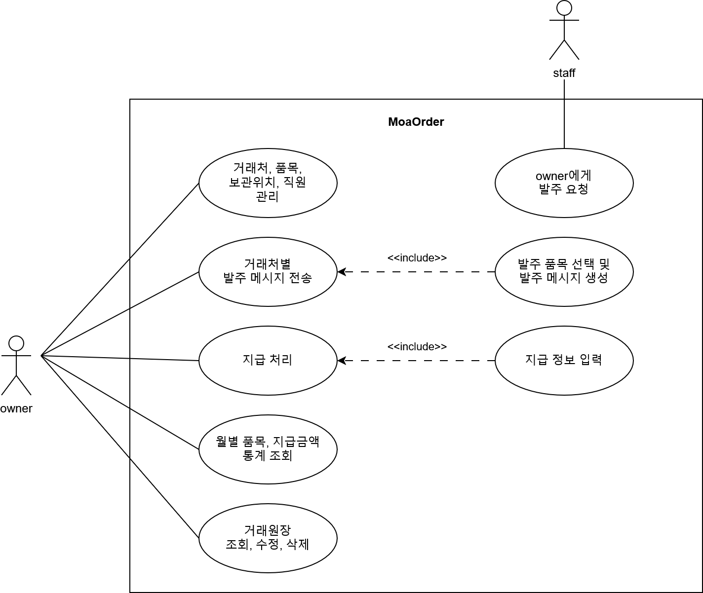

# Project Definition

## 1. Introduction

모아발주는 매장 및 장부 관리를 도와주는 서비스 입니다. 소규모 자영업자를 대상으로 하고 있습니다. 거래처와 메시지, SNS, 메일 등으로 발주 주문을 넣는 자영업자를 위한 서비스입니다. 

서비스는 아래 기능들을 제공합니다.

- 거래처, 품목, 보관 위치 등의 매장 관리
- 거래처별 발주 메시지 생성 및 전송
- 주문(거래처, 품목 목록)건에 대한 미지급, 지급 관리
- 월별 품목, 지급금액 통계 제공
- 거래원장 조회, 수정, 삭제 기능 제공

### 1.1 Requirements Overview

소규모 자영업자는 모아발주를 통해 매장 기준정보를 관리하고,
거래처별 발주부터 미지급·지급 관리, 통계 및 거래원장 확인까지 수행할 수 있습니다.

---
