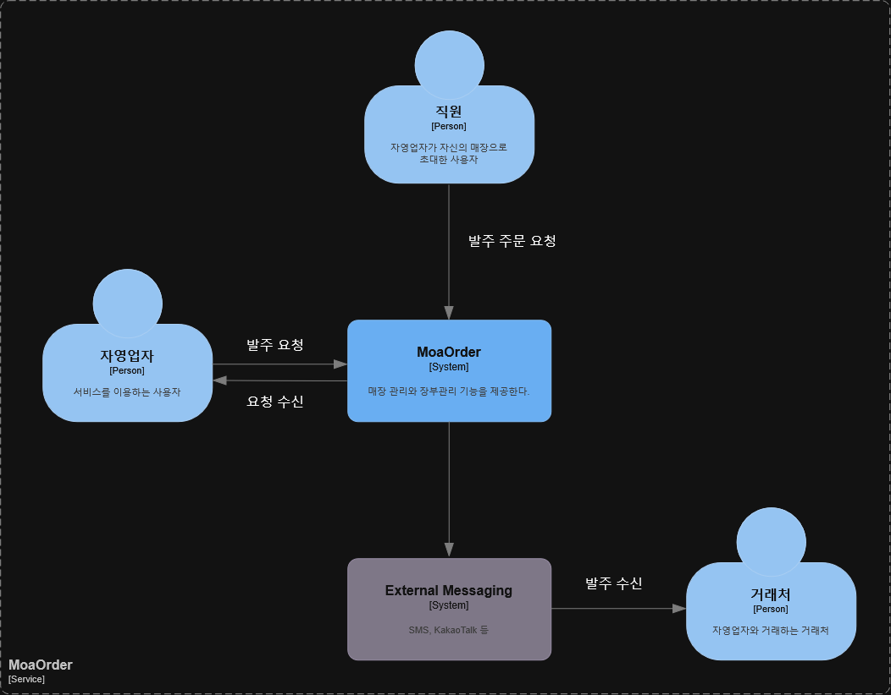
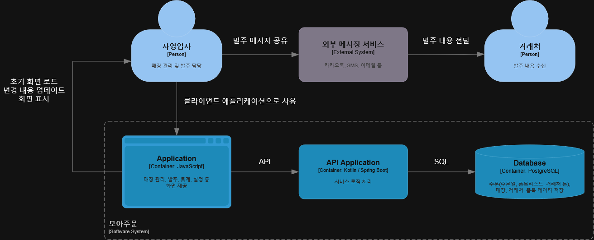

# Project Definition

## 1. Introduction

모아주문는 매장 및 장부 관리를 도와주는 서비스 입니다. 소규모 자영업자를 대상으로 하고 있습니다. 거래처와 메시지, SNS, 메일 등으로 발주 주문을 넣는 자영업자를 위한 서비스입니다. 

서비스는 아래 기능들을 제공합니다.

- 거래처, 품목, 보관 위치 등의 매장 관리
- 거래처별 발주 메시지 생성 및 전송
- 주문(거래처, 품목 목록)건에 대한 미지급, 지급 관리
- 월별 품목, 지급금액 통계 제공
- 거래원장 조회, 수정, 삭제 기능 제공

### 1.1 Requirements Overview

소규모 자영업자는 모아주문를 통해 매장 기준정보를 관리하고,
거래처별 발주부터 미지급·지급 관리, 통계 및 거래원장 확인까지 수행할 수 있습니다.

---

## 2. Constraints

### 2.1 Technical Constraints

| ID  | Constraint                         | Background and/or Motivation               |
| --- | ---------------------------------- | ------------------------------------------ |
| TC1 | 백엔드는 Kotlin으로 개발한다.                | 팀이 Kotlin에 익숙하며, 타입 안정성과 유지보수성을 확보하기 위함이다. |
| TC2 | 애플리케이션 프레임워크로 Spring Boot를 사용한다.   | 인증, 데이터 접근 및 웹 API 구현에 필요한 생태계를 활용하기 위함이다. |
| TC3 | PostgreSQL을 주 데이터베이스로 사용한다.        | 주문 및 지급 데이터의 관계와 트랜잭션 일관성을 관리하기 위함이다.      |
| TC4 | 애플리케이션은 Docker 컨테이너로 실행할 수 있어야 한다. | 개발 환경과 운영 환경의 차이를 줄이고 배포를 단순화하기 위함이다.      |

### 2.2 Operational Constraints

| ID  | Constraint | Background and/or Motivation |
| --- | ---------- | ---------------------------- |
| OC1 | 서비스는 직접 관리하는 서버에 셀프호스팅한다. | 초기 운영 비용을 통제하고 운영 환경을 직접 관리하기 위함이다. |
| OC2 | Docker Compose를 이용하여 배포할 수 있어야 한다. | 소규모 운영 환경에서 애플리케이션과 데이터베이스 배포를 단순화하기 위함이다. |
| OC3 | 운영 데이터를 정기적으로 백업할 수 있어야 한다. | 서버 장애나 운영 실수로 인한 데이터 손실에 대비하기 위함이다. |

---

## 3. Context and Scope

### 3.1 Business Context

**자영업자**

자영업자는 거래처, 품목, 보관위치 등의 매장 정보를 관리하고, 거래처별 발주 메시지를 생성하여 거래처에 전송하며, 주문 건에 대해 지급 처리를 수행할 수 있습니다. 거래원장을 통해 주문 내역을 수정하거나 삭제할 수 있습니다.

**직원**
직원은 자영업자가 셀프 호스팅한 서버에 접속하여 제한된 매장 정보를 조회할 수 있습니다. 발주 메시지를 생성하고 거래처가 아닌 자영업자에게 주문을 요청할 수 있습니다.

**거래처**
거래처는 해당 서비스의 사용 대상이 아닙니다. 거래처는 자영업자가 보낸 발주 메시지를 기존 SNS, 메일 등으로 확인할 수 있습니다.

### 3.2 System Context

### 3.3 Scope

#### In Scope

- 매장별 거래처, 품목 및 보관 위치 관리
- 거래처별 주문 작성
- 거래처별 발주 메시지 생성
- 주문별 미지급·지급 상태 관리
- 월별 품목 및 지급금액 통계
- 거래원장 조회, 수정 및 삭제

#### Out of Scope

- 외부 메시징 서비스 API를 이용한 자동 발송
- 실제 대금 결제 및 계좌이체
- 세금계산서 발행
- 회계 및 ERP 시스템 자동 연동
- 배송 및 재고 수량 자동 관리